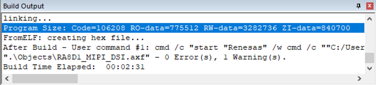
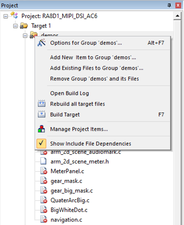
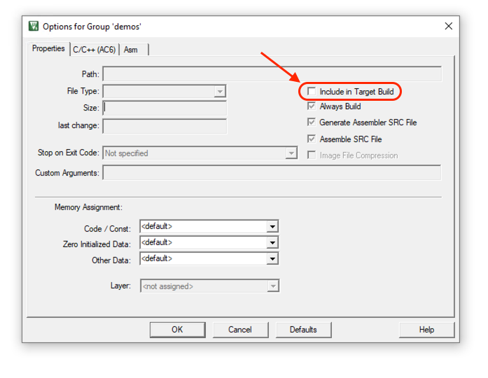
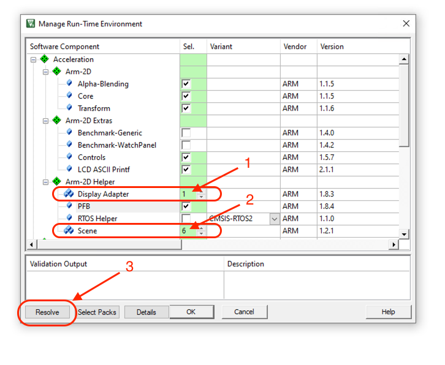
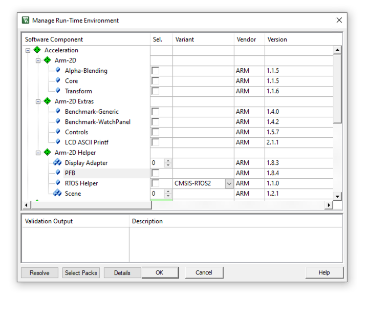
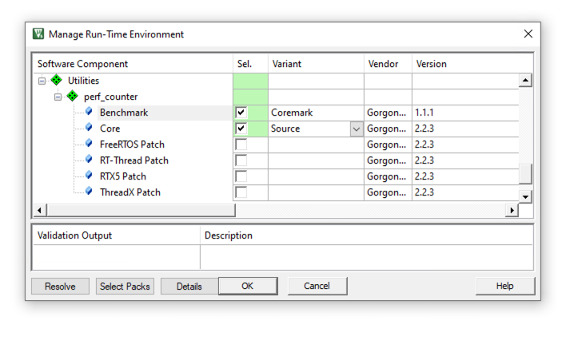

# MDK Template for EK-RA8D1

This is a **modified** MDK project template for EK-RA8D1. For the moment I writing this document (14 Dec 2023), the RA-generated MDK projects have some known limitations:

- Only supports **microLib** (this has some performance impact)
- Does NOT fully follow the standard scatter-loading and C-library startup procedure suggested by the CMSIS standard.
- DCache is disabled by default (this has a significant performance impact)
- ITCM and DTCM only accept contents that are placed in dedicated sections `.dtcm_data.*` and `.item_data.*`. Otherwise, BusFult will be triggered. 
- Numerous warnings are thrown out once **Link-Time-Optimization** is enabled, although they are safe to ignore. (This prevents users from allowing Arm Compiler 6 to do further optimization possible)


To buy time for the Renesas Team to solve the issue and to provide a template for evaluation purposes, we modified an RA-generated MDK project and patched the issues aforementioned.

### Feature

- Complaint with CMSIS standard
- DTCM and ITCM are available for random access without special procedures
- Supports both microlib and normal C library
- Free to use All available optimization levels (including -Omax and -Omin)
- Integrates [`perf_counter`](https://github.com/GorgonMeducer/perf_counter) and ready to run [`Coremark`](https://github.com/eembc/coremark)
- Ready to evaluate [`Arm-2D`](https://github.com/ARM-software/Arm-2D) and provides demos.
- Validated with [FSP 4.4.0](https://github.com/renesas/fsp/releases/tag/v4.4.0)


## How to Use

### How to Deploy

1. Download the latest [MDK](https://www.keil.com/download/product/) and install the [community license](https://www.keil.com/pr/article/1299.htm) if you haven't have a valid license yet. 

2. Clone the project with the following command line:

```shell
git clone https://github.com/GorgonMeducer/EK-RA8D1
```

3. Install required cmsis-packs
   - [FSP 4.4.0](https://github.com/renesas/fsp/releases/tag/v4.4.0) : MDK_Device_Packs
   - Pack Installer: `Perf_counter`

4. Enter the folder `EK-RA8D1` and open the project `RA8D1_MIPI_DSI_AC6.uvprojx`.

5. Compile.

If everything goese well, you should see the following output in Build Output window:

 

Congratulations!


### How to Run Arm-2D Demos

1. Right click the group `demos` in project view (as shown below):

 


Select `Options for Group demos `. Ensure the option  `Include in Target Build` is selected.

 

2. Open `Manage Run-Time Environment` window in menu.

 

Expand `Arm-2D Helper` and set the `Display Adapter` to `1` and set the `Scene` to `6` (as we have 6 pre-built scenes for demonstration). Before close the window, press `Resolve` button to resolve warnings in yellow.

3. Compile and debug. 


### How to Run Coremark

1. Right click the group `demos` in project view (as shown below):

 


Select `Options for Group demos `. Ensure the option  `Include in Target Build` is unselected.

 

2. Open `Manage Run-Time Environment` window in menu. Expand `Arm-2D`,`Arm-2D Extras` and ` Arm-2D Helper`. Unselect all components,  set the `Display Adapter` to 0 and set the `Scene` to `0` as shown below:

 

Expand `Utilities::perf_counter` , select both `Benchmark::Coremark` and `Core::Source`. Click OK to close the window.



3. Compile and debug.  You can find the coremark report in `Debug (printf) View` after entering the debug mode. 


## FAQ

- ### Where is the `main()` function?

The ordinary `main()` is hidden in this project, instead, using the `hal_entry()` is suggested by Renesas. In this project, all user code is placed in function `mipi_dsi_start_display()`.

- ### How to place data and/or code to TCMs?

  - Placing data to DTCM

    You can place variables to DTCM by applying the `__attribute__((section(".dtcm_data")))`. For data with different attributes, e.g. RO, RW or ZI, you can use the following attributes:

    ```c
    __attribute__((section(".dtcm_data.ro")))
    const char example_string[]={"hello world\r\n"};
    
    __attribute__((section(".dtcm_data.rw")))
    int32_t example_look_up_table[] = {2,3,5,7,11,13,17,19};
    
    __attribute__((section(".dtcm_data.zi")))
    uint8_t example_buffer[512];
    ```

    or some unique section name with the pattern `.dtcm_data.xxxx`. 

  - Placing code to ITCM

    You can place code to ITCM by applying the  `__attribute__((section(".itcm_data")))` before the function. 

    **NOTE: STACK and HEAP have already been placed at DTCM.**

- ### How to Change STACK and HEAP size?

    Open the header file `bsp_cfg.h` and 

    - modify the macro `BSP_CFG_STACK_MAIN_BYTES` to adjust the stack size.
    - modify the macro `BSP_CFG_HEAP_BYTES` to adjust the heap size.

